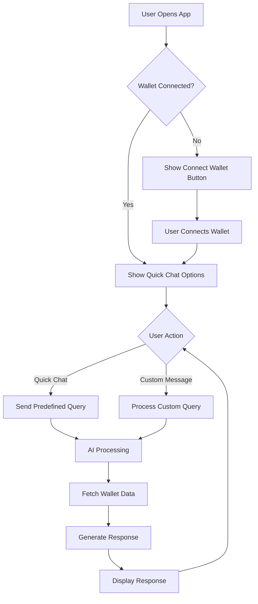

# MetaMask AI Agent

A modern web application that combines MetaMask wallet integration with AI-powered assistance for managing your cryptocurrency portfolio. This project provides a natural language interface to interact with your wallet, making crypto management more accessible and user-friendly.

## Features

### 1. Natural Language Interface

- Chat naturally with an AI assistant about your crypto portfolio
- Get real-time insights and information about your wallet
- Support for various types of queries and commands

### 2. Wallet Integration

- Seamless MetaMask wallet connection
- Real-time balance tracking
- Transaction history viewing
- Network information display
- Token management

### 3. Quick Actions

- Pre-defined quick chat options for common queries
- One-click access to important wallet information
- Streamlined user experience

### 4. Modern UI/UX

- Clean, intuitive interface
- Responsive design for all devices
- Real-time loading states and feedback
- Beautiful animations and transitions

## 🔄 Flow Chart



## Tech Stack

- **Frontend Framework**: Next.js 14 with App Router
- **UI Components**: Tailwind CSS, Heroicons
- **Wallet Integration**: MetaMask SDK
- **AI Integration**: OpenAI GPT-3.5
- **Blockchain Interaction**: Ethers.js
- **API Integration**: Etherscan API


## Screenshots


## Installation

1. Clone the repository:

```bash
git clone https://github.com/jayshreeanand/metamask-ai-agent.git
cd metamask-ai-agent
```

2. Install dependencies:

```bash
npm install
```

3. Create a `.env.local` file in the root directory with the following variables:

```env
NEXT_PUBLIC_OPENAI_API_KEY=your_openai_api_key_here
NEXT_PUBLIC_ETHERSCAN_API_KEY=your_etherscan_api_key_here
```

4. Start the development server:

```bash
npm run dev
```

5. Open [http://localhost:3000](http://localhost:3000) in your browser.

## API Keys Required

1. **OpenAI API Key**

   - Get your API key from [OpenAI Platform](https://platform.openai.com/)
   - Used for AI-powered responses and natural language processing

2. **Etherscan API Key**
   - Get your API key from [Etherscan](https://etherscan.io/apis)
   - Used for fetching transaction history and blockchain data

## Usage

1. **Connect Wallet**

   - Click the "Connect Wallet" button
   - Approve the connection in MetaMask

2. **Start Chatting**

   - Use quick chat options for common queries
   - Type custom questions in the chat input
   - View real-time responses with wallet data

3. **Common Queries**
   - "What's my balance?"
   - "Show recent transactions"
   - "Show my tokens"
   - "Which network am I on?"

## Security

- All wallet interactions are handled through MetaMask's secure interface
- No private keys are stored or processed by the application
- API keys are stored securely in environment variables
- HTTPS encryption for all API communications

## 🤝 Contributing

1. Fork the repository
2. Create your feature branch (`git checkout -b feature/AmazingFeature`)
3. Commit your changes (`git commit -m 'Add some AmazingFeature'`)
4. Push to the branch (`git push origin feature/AmazingFeature`)
5. Open a Pull Request

## 📝 License

This project is licensed under the MIT License - see the [LICENSE](LICENSE) file for details.
